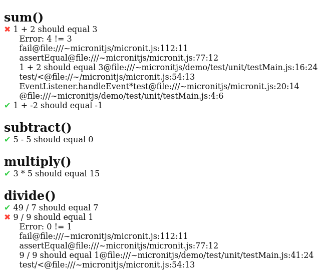

# micronit.js

micronit.js is a minimal unit testing library for Javascript that runs in the browser and does not require any dependencies.

## Installation

Clone the Github repository:

```console
$ gh repo clone tekinosman/micronitjs
$
```

or download [the micronit.js file](https://raw.githubusercontent.com/tekinosman/micronitjs/main/micronit.js) directly.

## Usage

To use micronit.js, you need to include 3 script tags in the head of your HTML page:

- The micronit.js library
- The function(s) to be tested
- The unit tests

```html
<script src="<path_to_micronit>"></script>
<script src="<path_to_function(s)>"></script>
<script src="<path_to_unit_tests>"></script>
```

You also need to add a *micronit* id to the element where you want the test results to be displayed.

For example, assuming the following folder structure:

<pre>
<strong>&ltproject_root&gt</strong>
├── index.html
├── main.js
├── micronit.js
└── <strong>test</strong>
    └── <strong>unit</strong>
        └── testMain.js
</pre>

index.html should look like this:

```html
<html>

<head>
    <!-- The micronit library -->
    <script src="../micronit.js"></script>

    <!-- The function(s) to be tested -->
    <script src="main.js"></script>

    <!-- Where unit tests are written -->
    <script src="test/unit/testMain.js"></script>
</head>

<!-- Where test results are shown -->
<body id="micronit"></body>

</html>
```

main.js should contain the function(s) to be tested, such as:

```javascript
function sum(n, m) {
    return n + m;
}

function subtract(n, m) {
    return n - m;
}

function multiply(n, m) {
    return n * m;
}

function divide(n, m) {
    return n / m;
}
```

test/unit/testMain.js should contain the unit tests, using the *unit.test* function and the available assertions. For example:

```javascript
// Import the needed assertions
let assertEqual = unit.assertEqual;

unit.test({
    // This is the category or function being tested
    "sum()":
    {
        /* A description of what the function is supposed to do
         *  given the inputs
         */
        "1 + 2 should equal 3": () => {
            /* An erroneous expected value (4) is used
             * to show what happens when
             * expected value != actual value
             */
            assertEqual(4, sum(1, 2));
        },
        "1 + -2 should equal -1": () => {
            assertEqual(-1, sum(1, -2));
        },
    },

    "subtract()": {
        "5 - 5 should equal 0": () => {
            assertEqual(0, subtract(5, 5));
        },
    },
    "multiply()":
    {
        "3 * 5 should equal 15": () => {
            assertEqual(15, multiply(3, 5));
        },
    },

    "divide()": {
        "49 / 7 should equal 7": () => {
            assertEqual(7, divide(49, 7));
        },
        "9 / 9 should equal 1": () => {
            // Another erroneous expected value
            assertEqual(0, divide(9, 9));
        },
    }
});
```

Opening index.html in the browser shows the test results:


## ADDING ASSERTIONS

Additional assertions can be added after the *test* function in [micronit.js/unit](https://github.com/tekinosman/micronitjs/blob/main/micronit.js#L77).

## TODO

- Consider adding more assertions
- Improve this README

## Contributing

Contributions to this repository are welcome, but follow these guidelines before submitting an issue or a pull request.

### Submitting an issue

Issue submissions are for bug reports, questions and suggestions.

### Feature requests

Feature requests might be taken into consideration if they stay within the library's scope. This library aims to be minimal and simple, so not all features may be accepted.

## License

Licensed under the [MIT](LICENSE) license.
